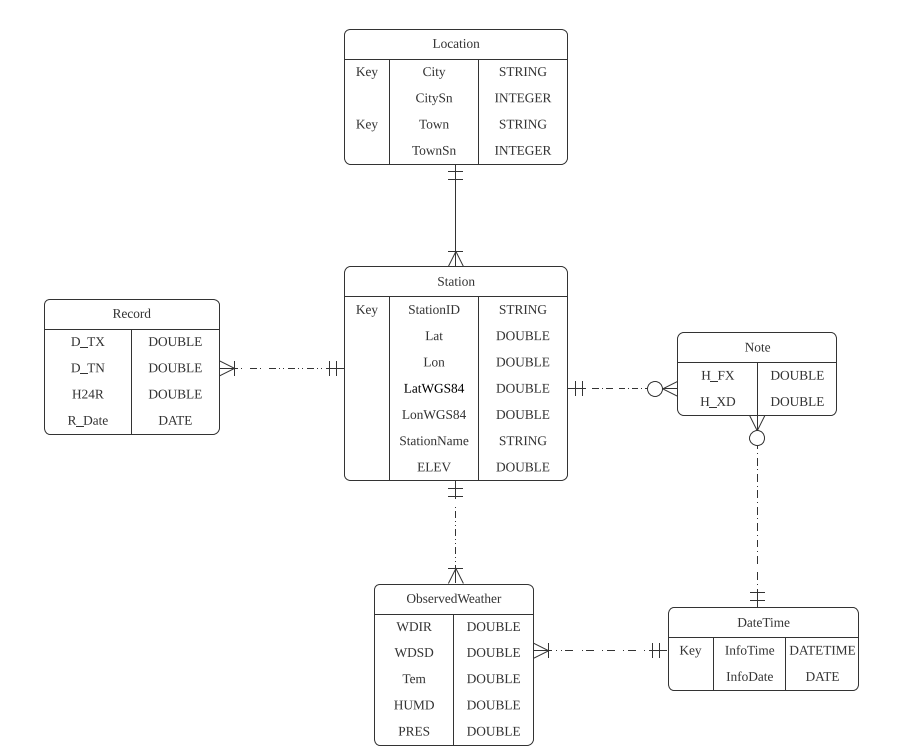
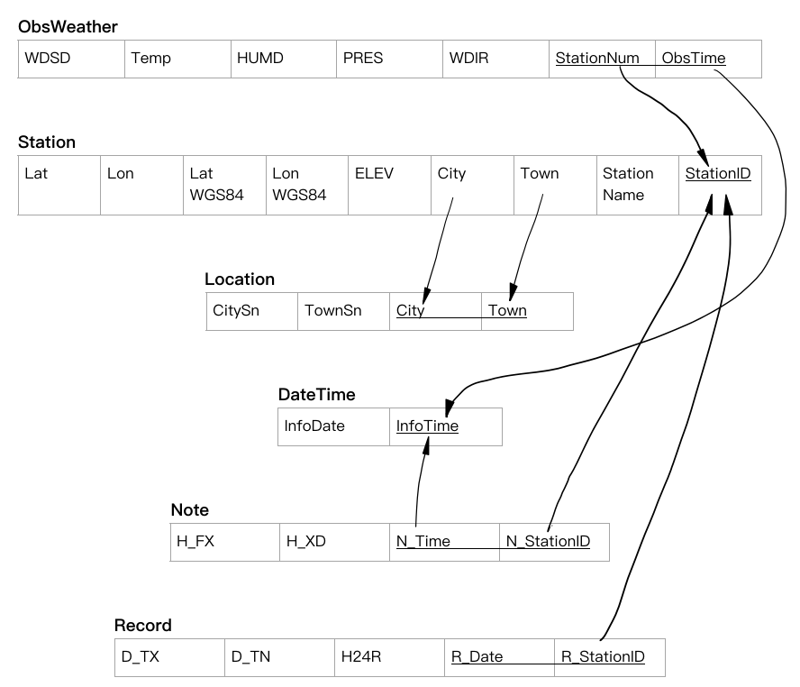

# 自動氣象站 

## Outline
- [題目說明](#題目說明)
- [資料需求分析](#資料需求分析)
- [系統功能性分析](#系統功能性分析)
- [E-R Diagram](#E-R-Diagram)
- [Relational Model](#Relational-Model)
- [系統架構](#系統架構)
- [Reference](#Reference)
- [資料來源](#資料來源)

## 題目說明 
建立資料庫以整合由不同氣象觀測站所觀測到的氣象條件，以利於通過分析氣象變化趨勢來預測未來的天氣情況。由於資料權限問題，僅收集12.12-12.18這一週內觀測到的氣象狀況。 

## 資料需求分析 
### Station-觀測站：所觀測到的氣象來自不同氣象站，因此需要對不同測站建立table 
| Attribute | Property |
| --------- | -------- |
| Lat - TWD67 緯度 | DOUBLE, non-null |
| Lon - TWD67 經度 | DOUBLE, non-null | 
| LatWGS84 - TWD97/WGS84 緯度 | DOUBLE, non-null | 
| LonWGS84 - TWD97/WGS84 經度 | DOUBLE, non-null | 
| LocationName - 測站名稱 | STRING, non-null, unique | 
| StationID - 測站編號 | STRING, non-null, unique | 
| ELEV - 海拔高度(公尺) | DOUBLE, non-null, positive | 

 

### ObsWeather-測站觀測之氣象 
| Attribute | Property |
| --------- | -------- |
| WDIR - 風向(度) | DOUBLE, 0 表示無風，大於 0 表示一般風向，non-negative | 
| WDSD - 風速(公尺/秒) | DOUBLE, 0 表示無風, non-negative | 
| Temp - 溫度(攝氏) | DOUBLE，non-null | 
| HUMD - 相對濕度(百分比) | DOUBLE, [0, 1] | 
| PRES - 測站氣壓(百帕) | DOUBLE, non-null | 

 

### Record-當日氣象情況 
| Attribute | Property |
| --------- | -------- |
| D_TX - 本日最高溫 | DOUBLE, non-null | 
| D_TN - 本日最低溫 | DOUBLE, non-null | 
| H24R - 日累積雨量 | DOUBLE, can be null | 
| R_Date - 當日日期 | DATE, non-null | 

### Note-小時氣象情況(並非每小時都會回傳，可當作是附加的資料） 
| Attribute | Property |
| --------- | -------- |
| H_FX - 小時最大陣風風速 | DOUBLE | 
| H_XD - 小時最大陣風風向 | DOUBLE | 

### Location-氣象紀錄的地點(縣市、鄉鎮) 
| Attribute | Property |
| --------- | -------- |
| City - 縣市 | DOUBLE, non-null | 
| CitySn - 縣市編號 | INTERGER, non-null, non-unique | 
| Town - 鄉鎮 | STRING, non-null | 
| TownSn - 鄉鎮編號 | INTEGER, non-null, non-unique  | 

### DateTime-與該紀錄相關聯之時間 
| Attribute | Property |
| --------- | -------- |
| InfoTime - 資料代表時間 | DATETIME, non-null | 
| InfoDate - 資料代表日期 | DATE, non-null | 

## 系統功能性分析 

+ 可查詢某日某地的氣象情況，如溫度、濕度、下雨情況等
+ 可統計某段時間內某地的降水量和下雨天數
+ 可查詢某日某縣市的最高溫、最低溫 

## E-R Diagram

## Relational Model

## 系統架構
| System   | Architecture                 |
|----------|------------------------------|
| 系統功能 | CRUD,  Query                 |
| 開發語言 |  HTML, CSS, javascript, PHP  |
| DBMS     | MySQL(PhpMyAdmin)            |
| 工具     | XAMPP, ngrok                 |
| 模組     | Apache Server, MySQL         |

## Reference

[登入系統](http://www.tastones.com/zh-tw/tutorial/php/php-mysql-login-system)

[可視/隱藏密碼](https://github.com/jiangxh1992/HTML5InputDemo)

[PHP 與 MySQL 入門](http://web.nuu.edu.tw/~ychwang/962PHP/Ch05-Hwang.pdf)

[HTML-清單](https://ithelp.ithome.com.tw/articles/10239506)

[系統架構](https://drive.google.com/file/d/1RePZHXuMjtmKXMBDZAjX5FZJBWGrhv-c/view)

[XAMPP](https://www.kjnotes.com/devtools/54)

[XAMPP MySQL](https://a091234765.pixnet.net/blog/post/403781468-%5B%E7%B6%B2%E9%A0%81%E6%8A%80%E5%B7%A7%E5%AD%B8%E7%BF%92%E7%AD%86%E8%A8%98%5Dxampp-mysql%E7%99%BB%E5%85%A5%E8%A8%AD%E7%BD%AE)

[ngrok](https://www.youtube.com/watch?v=7TeJlvTRa8g)

[CRUD](https://ithelp.ithome.com.tw/articles/10206716)

[CRUD - READ](https://ithelp.ithome.com.tw/articles/10206254)

[Connect to Database](https://ithelp.ithome.com.tw/articles/10206076)

[How to run a SELECT query using Mysqli](https://phpdelusions.net/mysqli_examples/select)

[Mysqli SELECT query with prepared statements](https://phpdelusions.net/mysqli_examples/prepared_select)

[User form search input vs select queries](https://stackoverflow.com/questions/56813530/when-to-use-prepared-statements-in-php-mysqli-user-form-search-input-vs-selec)

[How to retain drop down values after submit ?](https://www.daniweb.com/programming/web-development/threads/380050/how-to-retain-drop-down-values-after-submit#post1636019)

## 資料來源

[交通部數據匯流平台 自動氣象站-氣象觀測資料](https://ticp.motc.gov.tw/ConvergeProj/dataService/viewdata?setId=00974&title=%E8%87%AA%E5%8B%95%E6%B0%A3%E8%B1%A1%E7%AB%99-%E6%B0%A3%E8%B1%A1%E8%A7%80%E6%B8%AC%E8%B3%87%E6%96%99&metadata=00974)
